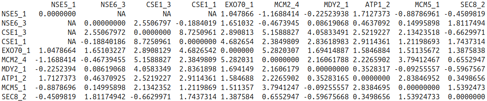

# ERC (Evolutionary Rate Covariation)
This software is for determining Evolutionary Rate Covariation (ERC) between pairs of genes, using R.

## Input:
You will need a `.tre` file containing Newick format trees of the genes you want to examine. Part of the workflow is to create a master tree of all the species and their corresponding branch lengths. In light of this, optionally, you can provide a master tree, but if you do not have one the program will make one from the list of trees you provide in your `.tre` file.

## Output:
The code will output a correlation residual matrix and a matrix with branch values. The residual matrix has numbers representing ERC correlations; The higher the value is, the more correlated the gene pair's relative evolutionary rates are.

## Installation:
Check our [installation](https://github.com/nclark-lab/erc/blob/main/install.md) page for more details.


## Use Instructions:

Here we provide a simple explanation of how to use ERC, but you can also check out our [step-by-step tutorial](https://cdn.jsdelivr.net/gh/nclark-lab/erc@master/tutorial.pdf) .

**The script you should open and use is __runERC.R__**. This contains the workflow, which is comprised of several data-processing (and time-consuming) subfunctions.

For an overview of what these functions input, output, and do, please visit our [functions page](https://github.com/nclark-lab/erc/blob/main/functions.md).

First, set the tree and output file names, on lines 11 and 12. You may also need to add the full path to the other R files in this package, such as `ERC_functions.R` (further up in the code). Finally, you're ready to run the code!

At the end of execution, you will have a data object called "corres" which will also be saved as your output .RDS file. Use `corres[["cor"]]` to see and operate on the correlation matrix. `corres[["count"]]` represents the number of observations/branches that went into each correlation. To further examine the output, use the following analysis functions.

You will also have `ft_data`, the Fisher transformed matrix of data. This is what we recommend operating on.

## Analysis functions
Analysis functions to evaluate your ERC matrices are found at the end of the `ERC_functions.R` file. Here is what they do:
- `clean_list(list, names)`: makes sure that every item in `list` is found in `names`
- `pair_list(list, erc_matrix, na.val = -2)`: creates vector list of gene x gene ERC values, with no repeats or self x self entries. Optional NA replacement value
- `make_symmetric(erc_matrix)`: makes input ERC matrix symmetrical.
- `permTestMat(list,matrix,perms=10000)`: tests for `perms` permutatinos whether `list` gene list is significantly different from genes selected by random chance
- `fishertransformed_updated(erc_matrix)`: used to fisher transform the values from computeERC
- `betweencomplex(list1,list2, erc_matrix)`: returns subset matrix based on two gene lists

## Quickstart Guide
0. Install dependencies ([visit install page](https://github.com/nclark-lab/erc/blob/main/install.md))
1. Download package (either download from github or use `git clone`)
2. Open **runERC.R**. This is the file that you will need to execute the pipeline.
3. Set input and output file names on lines 11-12 of **runERC.R**
4. Run the program
   -  You may need to be explicit about source file paths if the code gives you an error.
   -  If using Rstudio, go to **Session>Set Working Directory>To Source File Location** to set the file location to runERC.R's containing folder
5. Manipulate corres matrices


## Sample analysis

```R
# 10 sample genes
genes = c("NSE5_1", "NSE6_3",  "CSE1_3",  "CSE1_1",  "EXO70_1",
          "MCM2_4",  "MDY2_1",  "ATP1_2",  "MCM5_1",  "SEC8_2")
# You could also generate a random sample with:
# genes = colnames(ft_data)[sample(1:length(ft_data), 10, replace=FALSE)]


# makes a matrix of the 10 genes against themselves
# (it can be against different genes too)
ft_filtered = betweencomplex(genes,genes,sym_ft)

#output
ft_filtered
```

